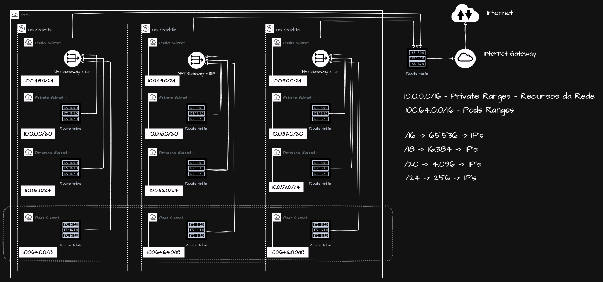

# LinuxTips Uncomplicating EKS Day 01 - Overviews, Initial Setups and Networking

In this first class, we will explore the Elastic Kubernetes Service (EKS), understanding its structure as an AWS managed service and learning about its main forms of use and practical application. Additionally, we will build together the solid foundation of our network infrastructure (VPC), performing strategic CIDR planning and designing public, private subnets dedicated to databases and pods, ensuring scalability and efficient organization as your environment grows. You will learn essential concepts of Network Access Control Lists (ACLs), understand how public and private subnets access the internet securely, and discover how to implement high availability across the entire network layer, preparing you to create robust and resilient Kubernetes environments from the start. The instructor live us the terraform made during the classes in [this link](https://github.com/msfidelis/linuxtips-curso-containers-aws-eks-networking), the network struct follows the image bellow

## Commands

> terraform init

> terraform apply --auto-approve -var-file=terraform.tfvars

> aws --endpoint-url=http://localhost:4566 ec2 describe-vpcs