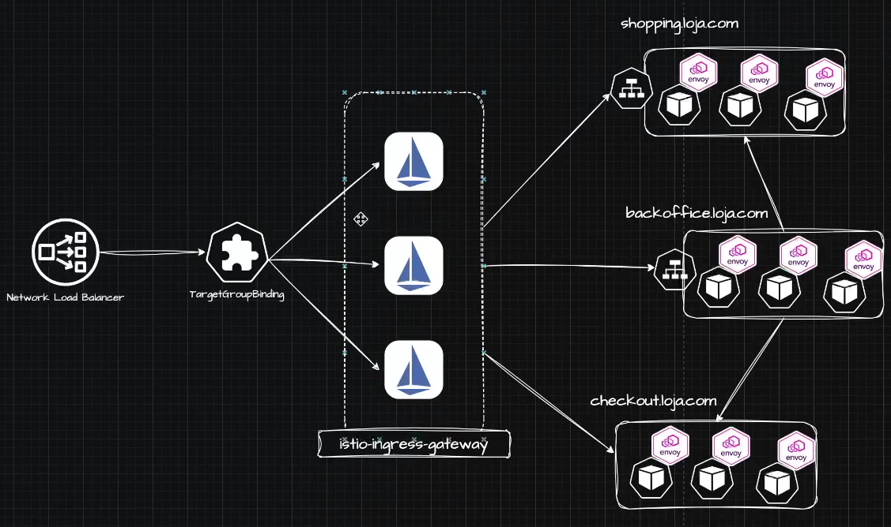
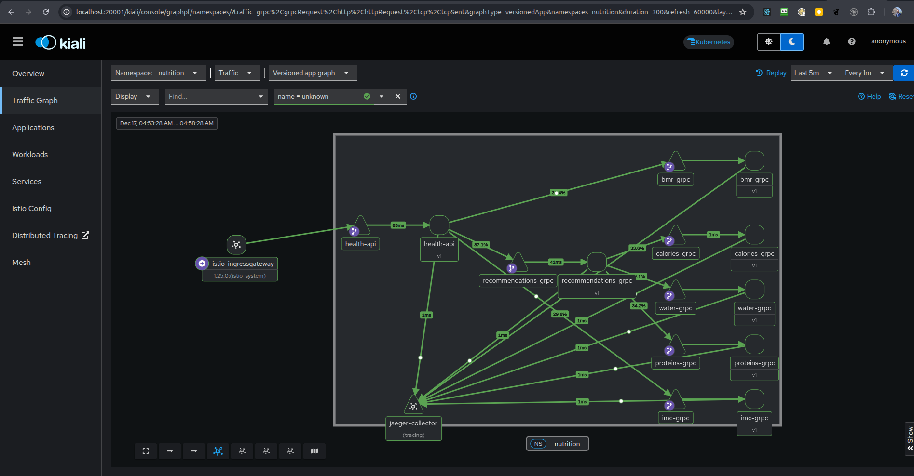

# LinuxTips Uncomplicating EKS Day 13 - Istio: Productizing the Istio Service Mesh



In this thirteenth lesson, you will take a leap forward in microservices management by productizing Istio Service Mesh within your EKS environment. We will transform Istio into a powerful internal product, deeply exploring its features such as advanced service exposure, Virtual Services, and Destination Rules, ensuring total flexibility in routing and traffic management. You will learn robust resilience strategies integrated directly into the mesh, in addition to implementing advanced observability with metrics capture using Pod Monitors. Together, we will provision automatic tracing with Jaeger and create a powerful visual experience with Kiali, allowing you to monitor and troubleshoot problems in an agile and intuitive way. By the end of this lesson, you will have Istio fully integrated and productive, adding immediate value to your Kubernetes platform with security, stability, and real-time visibility.

### Hosts
- Grab the auto generated DNS for you NLB
- Discovery the ip using nslookup
- Add the ip in your computer hosts

```bash
sudo vi /ect/hosts
```

```
0.0.0.0 grafana.ralvescosta.dev
0.0.0.0 health.ralvescosta.dev
0.0.0.0 chip.ralvescosta.dev
0.0.0.0 jaeger.ralvescosta.dev
0.0.0.0 kiali.ralvescosta.dev
```

```bash
curl --location --request POST 'http://health.ralvescosta.dev/calculator' --header 'Content-Type: application/json' --data-raw '{ "age": 26, "weight": 90.0, "height": 1.77, "gender": "M", "activity_intensity": "very_active" }' -iv
```

