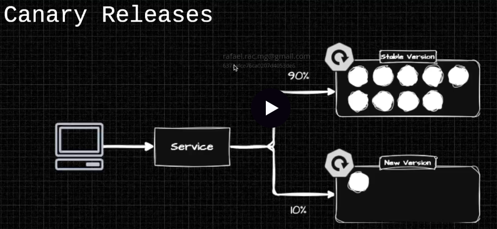
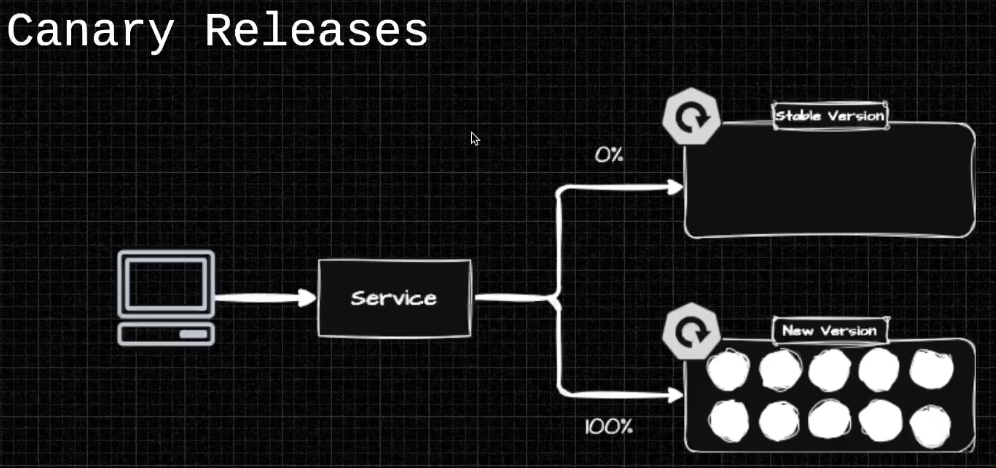
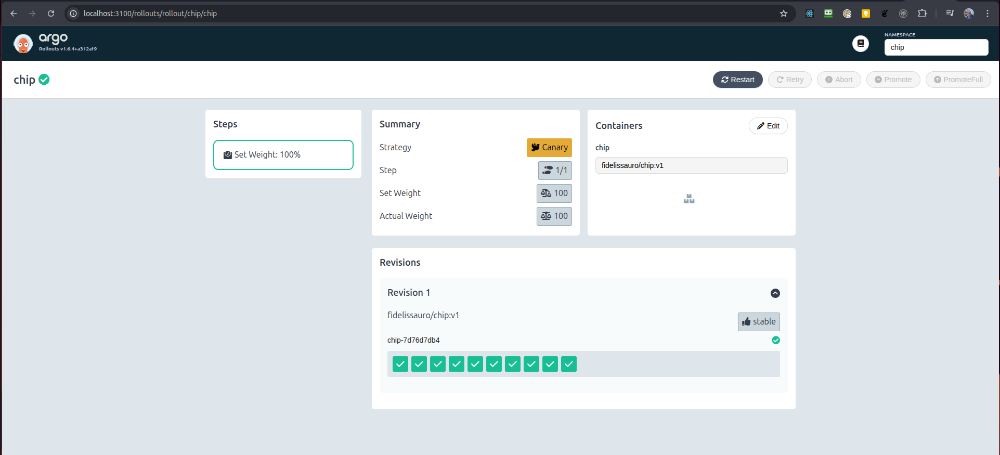

# LinuxTips Uncomplicating EKS Day 15 - Canary and Blue/Green Deployments with Argo-Rollouts

In this fifteenth lesson, you will master advanced deployment strategies with Argo Rollouts, starting to explore the powerful Argo stack within your EKS cluster. We will learn in practice how to perform deployments safely and reliably using Blue/Green and Canary Releases techniques, as well as manually triggered or automatically time-based variations. You will also understand how to manage warm-ups to ensure smooth transitions, run automated tests using AnalysisTemplates and make progression or rollback decisions based directly on metrics. Upon completion of this lesson, you will have the necessary tools to implement robust, intelligent and secure deployments, minimizing risks and ensuring maximum stability of your applications in Kubernetes.

